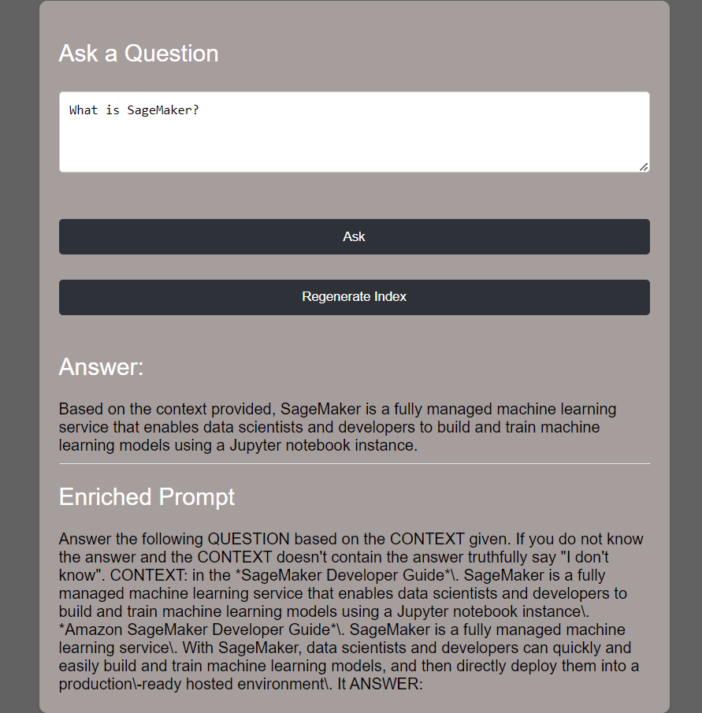

# RAG POC

# Installation steps (or live demo)
0. Extract sagemaker_documentation.zip contents into your s3 bucket in the folder sagemaker_documentation/

1. copy the src folder contents to your s3 bucket ej: assetsbucket/src (this code will be copied to ec2 instance to quickly setup the flask webapp)

2. Upload the AWS CloudFormation script (EC2-SageMaker-Flask-Setup.yaml) to AWS Console. CloudFormation->Stacks->Create Stack->Template is Ready->Upload a Template-> Select EC2-SageMaker-Flask-Setup.yaml.
   This script will create a (t2.large) instance to perform the rest of the installation (deploy LLM endpoint and embedding model endpoint) and act as the web server endpoint (flask).

3. Specify the following parameters with your own values or leave the default ones:
- BucketName (name of your own s3bucket name)
- DocumentationFolderName
- PineconeAPIKey

 The following artifacts will be created:
- SageMakerExecutionRole
- EC2 execution machine that creates:
- *SageMaker LLM generator endpoint creation (ml.g5.2xlarge)
- *SageMaker Embedding Model endpoint creation (ml.m5.large)
- venv creation
- Pulls web app scripts from s3 bucket
- Flask web app init

4. Use the assigned EC2 ip to access the webapp and make sure to use http://assigned_ip (dont use https)

5. The vector store index is already created so it is not necessary to re-create it. But if you want to recreate. Click on the ReGenerate button to:

- Reprocess chunks->create embeedings->store embeddings to vector store (this process will take around 15 mins) (while recreating index, the application will not work)

6. Ask any question about the documentationusing the provided form. The LLM will use enriched context from the documentation to answer more updated questions about the provided documentation. The answer and the prompt used is showed as well.